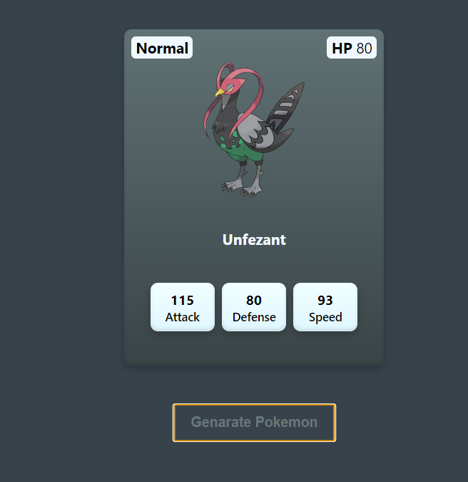

 Pokémon Card Generator

This is a simple web application that allows users to generate Pokémon cards randomly. The application fetches data from the PokeAPI and displays the Pokémon's name, official artwork image, primary type, HP, attack, defense, and speed stats in a card format.

## Demo

## Features

- Generate a random Pokémon card by clicking the "Generate Random" button.
- Display the Pokémon's official artwork image, name, primary type, HP, attack, defense, and speed stats in a card format.
- Responsive design for different screen sizes.

## Usage

1. Clone the repository or download the source code files.
2. Open the `index.html` file in a web browser.
3. To generate a random Pokémon card, click the "Generate Random" button.

## License
This project is licensed under the MIT License - see the LICENSE.md file for details.
